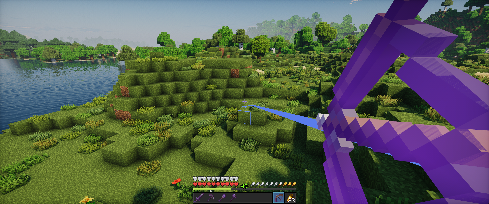
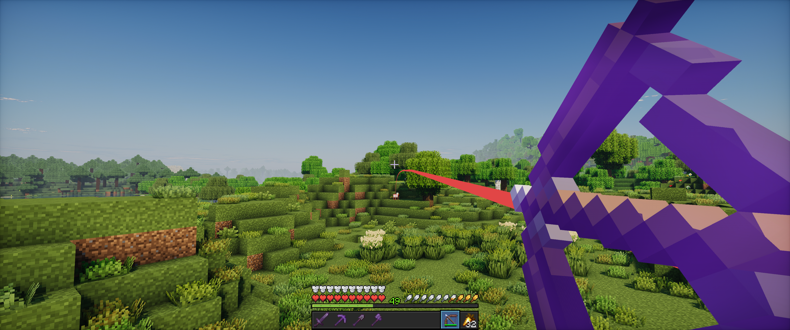

# Projectiles

A client-side Fabric mod that allows you to view the path of your projectiles before you shoot them.

## Features

- Calculates and renders the exact trajectory of your projectile.
- Dynamically highlights the predicted impact point (blue for blocks, red for entities).
- Supports bows, crossbows, tridents, snowballs, eggs, ender pearls and splash potions.
- Fully client-side; works perfectly on multiplayer servers.

## Usage

Hold `Left Alt` while holding a projectile item to display its predicted path.

The keybind can be changed in the Minecraft controls menu under the "Misc" category.

## Installation

1. Install [Fabric Loader](https://fabricmc.net/) for Minecraft 1.21.10.
2. Download the [Fabric API](https://modrinth.com/mod/fabric-api?version=1.21.10) mod.
3. Download the latest compiled `.jar` from the [Releases](https://github.com/coalaura/projectiles/releases) page.
4. Place both `.jar` files into your `.minecraft/mods` folder.

## Requirements

- Minecraft 1.21.10
- Fabric Loader 0.19.2+
- Fabric API
- Java 21+

## License

This project is licensed under the GNU General Public License v3.0 (GPL-3.0).
